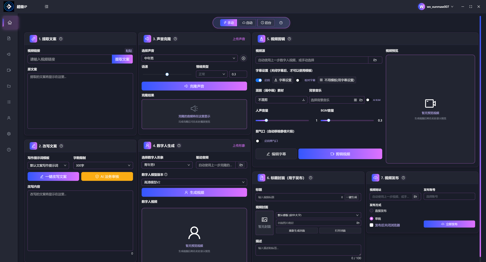

# 超级IP智能体🚀 AI 数字人口播视频自动化生成工具
> 超级IP智能体 自动生成视频智能体
> 
> 一个 本地运行、模块化、可扩展 的
> 数字人口播视频生成与多平台发布自动化工程



---

## 📌 项目简介

本项目2026款口播智能体4.0 专为解决这一痛点而生，集成 **云端算力调度**、NLP、语音合成、数字人渲染、视频编辑、多平台发布等核心能力，仅需简单配置，即可一键完成「对标文案提取→文案仿写→声音克隆→数字人口播→字幕/背景音乐添加→标题/封面生成→多平台发布」全链路自动化。**无需高性能本地设备支撑，低配电脑也能轻松驾驭**，让你从繁琐的视频制作流程中解放出来，专注于内容策略，轻松批量产出符合平台算法偏好的爆款口播视频。

---

## 支持一键自动产出爆款视频

- 1.自动提取对标文案 
- 2.自动进行文案仿写 
- 3.自动根据文案声音克隆 
- 4.自动生成数字人口播 
- 5.自动添加字幕 
- 6.自动添加背景音乐 
- 7.自动添加视频标题 
- 8.自动生成视频封面
- 9.自动将视频发布到各平台（某抖，某蝴蝶号、某手，某红书）

---

## ✨ 功能特性

* 自动提取并处理对标视频口播文案
* 文案语义级仿写与结构重组
* 高保真语音克隆与合成
* 数字人口播视频自动生成
* 自动生成字幕、背景音乐、标题与封面
* 多平台视频自动发布
* 全流程本地运行，无云端依赖

---

## 🧠 自动化流程

```text
对标文案提取
        ↓
文案仿写与优化
        ↓
语音合成 / 声音克隆
        ↓
数字人口播生成
        ↓
字幕 / BGM / 封面合成
        ↓
多平台发布
```

---

## 🧩 项目结构

项目采用 **模块化设计**，各功能模块解耦，便于替换与扩展：

```text
project-root/
├── script/              # 文案处理模块
│   ├── extractor/       # 对标文案提取
│   └── rewriter/        # 文案仿写
├── audio/               # 音频处理模块
│   ├── asr/             # 语音识别（Whisper）
│   └── tts/             # 语音合成（CosyVoice）
├── avatar/              # 数字人模块
│   └── heygem/          # 数字人驱动
├── video/               # 视频后期模块
│   ├── subtitle/        # 字幕生成
│   ├── bgm/             # 背景音乐
│   └── ffmpeg/          # 视频合成流水线
├── uploader/            # 发布模块
│   └── multi_platform/  # 多平台发布
└── client/              # 本地客户端
```

---

## 🔧 技术栈

| 模块    | 技术方案                        |
| ----- | --------------------------- |
| 语音识别  | Whisper                     |
| 语音合成  | CosyVoice                   |
| 数字人驱动 | HeyGem                      |
| 视频处理  | FFmpeg                      |
| 自动发布  | 平台 API / social-auto-upload |

---

## 📦 安装说明

> 由于模型文件及依赖体积较大，项目资源拆分提供。

1. **下载项目源码**
   详见：`代码地址.txt`

2. **安装运行环境**
   按照：`使用前必装.txt` 进行依赖安装

3. **启动本地客户端**

---

## ▶️ 使用方式

当前版本通过 **本地客户端** 控制完整流水线，基本使用流程如下：

1. 配置对标内容或原始文案
2. 执行文案仿写模块
3. 选择语音与数字人
4. 生成口播视频
5. 自动完成字幕、BGM、封面
6. 选择平台进行发布

---

## 🧪 设计原则

* **本地优先**：不依赖云端服务
* **模块解耦**：各模块可独立替换
* **流程可控**：每一步可单独调试
* **工程导向**：强调稳定性与可维护性

---
## 📖 联系交流

> 可联系交流wx：


---
## ⚠️ 已知限制

* 对硬件资源（尤其 GPU）有一定要求
* 不同平台上传接口可能存在变动
* 数字人口播效果依赖上游模型质量

---

## 🤝 致谢

本项目基于以下优秀开源项目与工具构建，在此表示感谢：

* [Whisper](https://github.com/openai/whisper)
* [CosyVoice](https://github.com/tencent-ailab/cosyvoice)
* [HeyGem](https://github.com/...)
* [social-auto-upload](https://github.com/...)
* FFmpeg

---

## 📄 使用限制与声明

* 本项目 **仅用于个人学习、研究和技术交流**
* 🚫 禁止任何形式的商业用途
* 🚫 禁止基于本项目提供付费服务或二次分发
* 使用本项目产生的内容与风险由使用者自行承担

---

## 📖 About

本仓库展示了一个 **完整、可运行的 AI 数字人口播视频自动化工程实现**，侧重 **系统集成与工程实践**。

适用于：

* AI 视频方向技术学习
* 数字人系统原型验证
* 自动化内容生成流程研究

---

